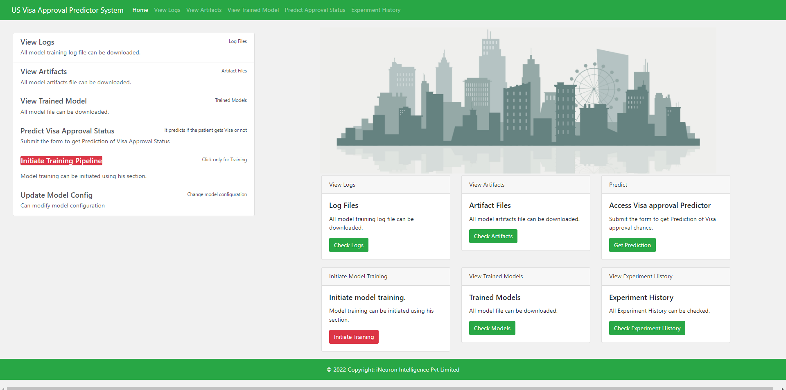
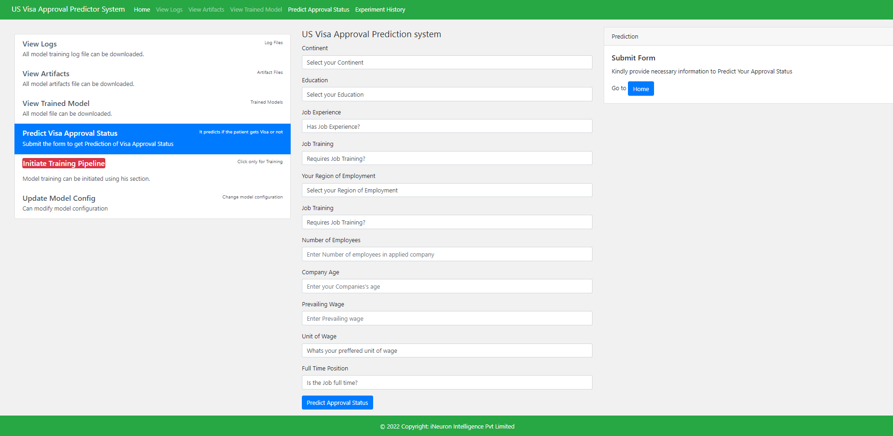
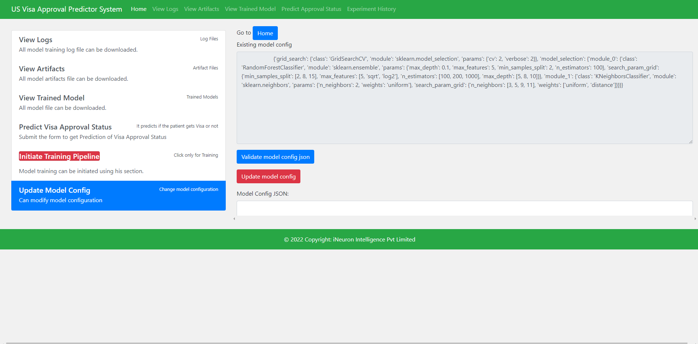
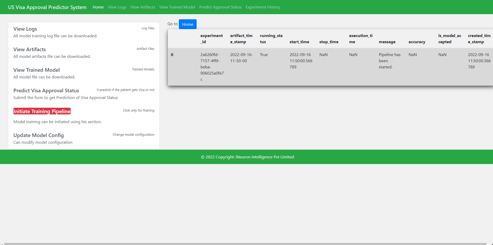

# US Visa Approval System

#### Language and Libraries

<p>
<a></a>
<a></a>
<a></a>
 <a></a>
<a></a>
<a></a>
</p>

### About
The Immigration and Nationality Act (INA) of the US permits foreign workers to come to the United States to work on either a temporary or permanent basis. 
The act also protects US workers against adverse impacts on working place and maintain requirements when they hire foreign workers to fill workforce shortages. The immigration programs are administered by the Office of Foreign Labor Certification (OFLC).

## Problem statement.

* OFLC gives job certification applications for employers seeking to bring foreign workers into the United States and grants certifications. 
* As In last year the count of employees were huge so OFLC needs Machine learning models to shortlist visa applicants based on their previous data.

**In this project we are going to use the data given to build a Classification model:**

* This model is to check if Visa get approved or not based on the given dataset.
* This can be used to Recommend a suitable profile for the applicants for whom the visa should be certified or denied based on the certain criteria which influences the decision.

For Detailed EDA and Feature engineering Check out notebook directory 

Their performances were compared in order to determine which one works best with our dataset and used them to predict if Visa will get approved or not from user input from Flask application.

#### Dataset is taken from Kaggle and stored in github as well as inside notebook directory 


## Features in Datasets:
The data contains the different attributes of employee and the employer. The detailed data dictionary is given below.

- `case_id`: ID of each visa application
- `continent`: Information of continent the employee
- `education_of_employee`: Information of education of the employee
- `has_job_experience`: Does the employee has any job experience? Y= Yes; N = No
- `requires_job_training`: Does the employee require any job training? Y = Yes; N = No
- `no_of_employees`: Number of employees in the employer's company
- `yr_of_estab`: Year in which the employer's company was established
- `region_of_employment`: Information of foreign worker's intended region of employment in the US.
- `prevailing_wage`: Average wage paid to similarly employed workers in a specific occupation in the area of intended employment. The purpose of the prevailing wage is to ensure that the foreign worker is - not underpaid compared to other workers offering the same or similar service in the same area of employment.
- `unit_of_wage`: Unit of prevailing wage. Values include Hourly, Weekly, Monthly, and Yearly.
- `full_time_position`: Is the position of work full-time? Y = Full Time Position; N = Part Time Position
- `case_status`: Flag indicating if the Visa was certified or denied

💿 Installing
1. Environment setup.
```
conda create --prefix venv python==3.9 -y
```
```
conda activate venv/
````
2. Install Requirements and setup
```
pip install -r requirements.txt
```
5. Run Application
```
python app.py
```

## 🔧 Built with
- Flask
- Python 3.9
- Machine learning
- Scikit learn

## Models Used
* Logistic Regression
* KNeighbors Classifier
* XGB Classifier
* CatBoost Classifier
* SVC
* AdaBoost Classifier
* RandomForest Classifier

From these above models after hyperparameter optimization we selected Top two models which were XGBRegressor and Random Forest Regressors and used the following in Pipeline.

* GridSearchCV is used for Hyperparameter Optimization in the pipeline.

* Any modification has to be done in  Inside Config.yaml which can be done in route **/update_model_config**

## `us_visa` is the main package folder which contains 

**Artifact** : Stores all artifacts created from running the application

**Components** : Contains all components of Machine Learning Project
- DataIngestion
- DataValidation
- DataTransformations
- ModelTrainer
- ModelEvaluation
- ModelPusher

**Custom Logger and Exceptions** are used in the Project for better debugging purposes.

## 📷 Application Screenshots
### **This is the screenshot of the final Webpage which was done using the Flask**


### **This is the screenshot of the webpage which gets user input for prediction**


### **This is the screenshot of the page in which user can change the model parameters for the experiment**


### **This is the screenshot of the page where u can check the experiment history**


## Conclusion
- This Project can be used in real-life by US Visa applicant so that they can improve their resume and criteria for the approval process
- Can be implemented in Visa application website for users.

=====================================================================


